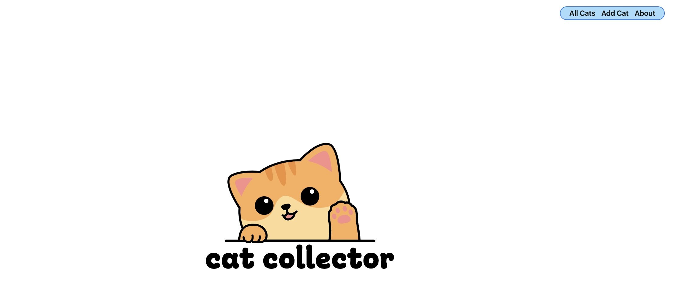
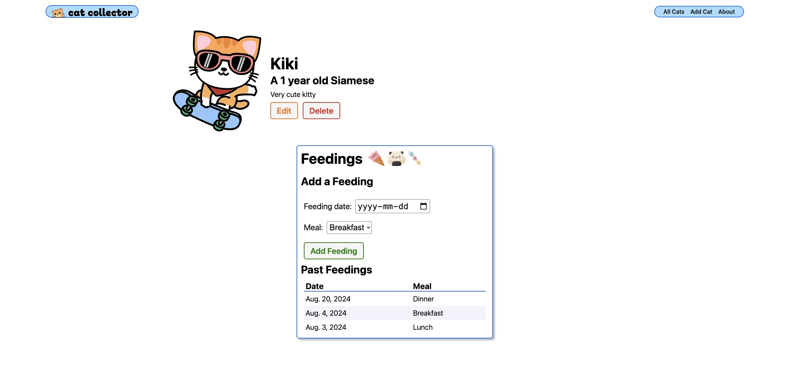

## Cat Collector 

Cat Collector is a Django-based web application that allows users to manage a collection of cats. The application features a user-friendly interface for viewing, adding, editing, and deleting cat entries.

### Features
- View all cats in the collection.
- Add new cats to the collection.
- Edit details of existing cats.
- Delete cats from the collection.
- Getting Started
- Follow these instructions to set up and run the project locally on your machine.

### Prerequisites
Make sure you have the following installed:

- Python 3.11 or higher
- PostgreSQL
- Git
- Installation
- Clone the repository

### To get started

Clone the repository
git clone https://github.com/AlejandraValdivia/django-crud-app-cat-collector.git
cd django-crud-app-cat-collector

Create and activate a virtual environment

``python3 -m venv venv``
``source venv/bin/activate``

### Install the required dependencies

``pip install -r requirements.txt``

***Set up environment variables***

Create a .env file in the root directory and add the following:

``SECRET_KEY=your-secret-key``
``DEBUG=True``
``DB_NAME=catcollector_9f79``
``DB_USER=your-db-username``
``DB_PASSWORD=your-db-password``
``DB_HOST=dpg-cr168qtds78s739ptcng-a.oregon-postgres.render.com``
``DB_PORT=5432``

### Set up the database

Make migrations and migrate the database

``python3 manage.py makemigrations``
``python3 manage.py migrate``

### Create a superuser

``python3 manage.py createsuperuser``

### Running the Application
Start the development server

``python3 manage.py runserver``

### Access the application

Open your web browser and go to http://127.0.0.1:8000/.

### Dependencies
The project uses the following main dependencies:

- Django - A high-level Python Web framework.
- dj-database-url - Utility to utilize the 12factor inspired DATABASE_URL in your Django application.
- psycopg2-binary - PostgreSQL database adapter for Python.
- python-dotenv - Reads key-value pairs from a .env file and can set them as environment variables.

For a complete list of dependencies, see the requirements.txt file.

### Deployment
- The application can be deployed to platforms like Render, Heroku, or any other cloud service that supports Django and PostgreSQL.

- Set environment variables on the hosting platform using the variables listed in the .env file.
- Ensure DEBUG is set to False in the production environment.

### Contributing
Feel free to submit issues and pull requests for new features, bug fixes, or improvements.

### License
This project is licensed under the MIT License.

